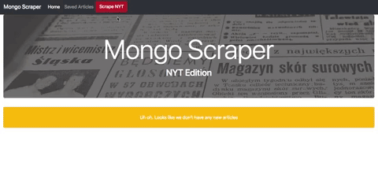

# NYT-Mongo-Scraper
This is a Node.js application that utilizes Cheerio and a MongoDB back-end to scrape and save NYT articles to a Bootstrap UI.

## Feature Overview
Scrape the New York Times homepage, then save and add notes to your favorite articles using this responsive application.



For a live example, see a deployed version to Heroku at [https://nyt-mongoscraper-ss.herokuapp.com/](https://nyt-mongoscraper-ss.herokuapp.com/ "deployed example")

## Downloading This Application
To use this application:

1. Ensure that Node.js, npm, and MongoDB are installed on your machine. For instructions, see the Technologies Used section below.

2. Next, clone this repo to your local machine:
```
git clone git@github.com:stoversa/NYT-Mongo-Scraper.git
```
3. Open the repo and execute the following in the bash terminal. Doing so should install the application's dependencies:
```
npm i
```
4. Run the application from the command line:
```
node server.js
```

### Technologies Used
- [Node.js and npm](https://nodejs.org/en/download/ "Download Node.js and npm"). First, this application relies on both Node.js and npm to download Node packages and to run the application. Users can download the latest versions of both using the link to the left.
- [MongoDB](https://www.mongodb.com/ "MongoDB") - This application assumes users have already installed MongoDB. Installation instructions should be found on the MongoDB website.


### NPM Packages
This application utilizes the following NPM packages:
- [express](https://www.npmjs.com/package/express "express")
- [express-handlebars](https://www.npmjs.com/package/express-handlebars "express-handlebars")
- [mongoose](https://www.npmjs.com/package/mongoose "mongoose")
- [body-parser](https://www.npmjs.com/package/body-parser "body-parser")
- [cheerio](https://www.npmjs.com/package/cheerio "cheerio")
- [request](https://www.npmjs.com/package/request "request")